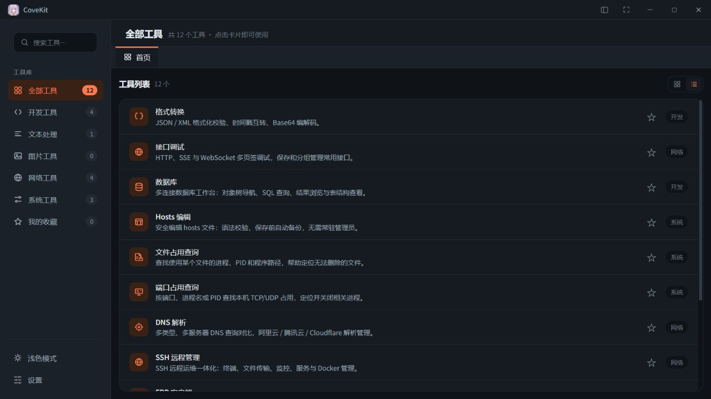
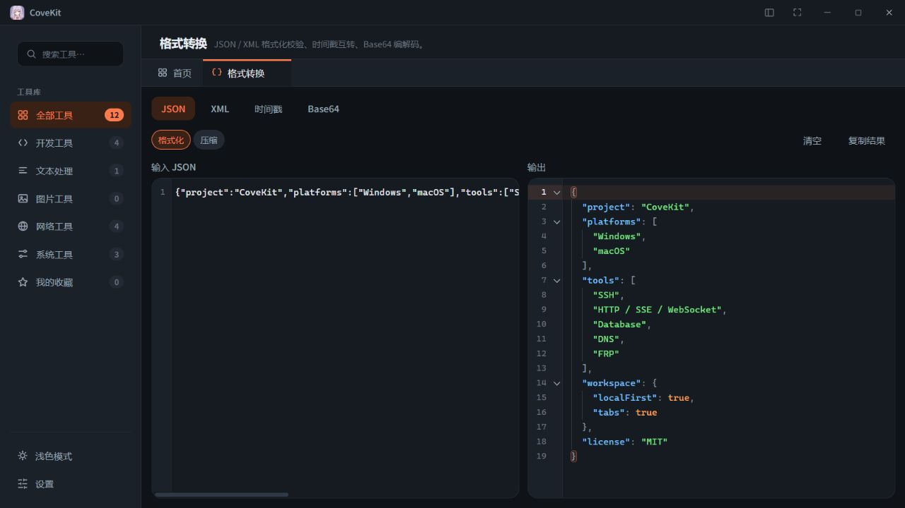

# CoveKit

面向开发者和个人服务器维护者的本地优先桌面工具箱。把 SSH 远程管理、接口调试、数据库操作和常用数据处理放在同一个工作区，减少日常开发与运维中的工具切换。

[版本下载](https://github.com/patchy23/CoveKit/releases) · [问题反馈](https://github.com/patchy23/CoveKit/issues) · [更新记录](CHANGELOG.md) · [开发文档](docs/README.md)

## 特性

- **围绕服务器开展工作**：在一个 SSH 工作区中使用终端、传输文件、编辑远程文件、查看资源与管理服务。
- **多工具并行使用**：工具搜索、收藏、最近使用和多页签工作区，切换工具时保留当前会话状态。
- **本地优先**：无需注册 CoveKit 账户；配置与工作数据保存在本机，可管理数据空间、存储位置及导入导出。
- **原生桌面集成**：基于 Tauri 2 与 Rust，使用系统 WebView；支持系统托盘、单实例唤起和中英文核心界面切换。

项目仍在持续开发中。以下列出当前源码中的能力；平台与外部服务的验证范围见[平台能力矩阵](docs/standards/09-平台能力矩阵.md)。

## 产品展示

工具库集中管理分类、搜索与常用工具：



格式转换支持输入与结果并排查看，使用统一的代码编辑器：



以上截图来自开发模式的前端预览，使用示例数据；组件实验室仅在开发构建显示。SSH、数据库及系统操作等原生能力需运行桌面应用，截图不代表这些能力已完成实机验证。

## 内置工具

| 工具 | 主要能力 |
| --- | --- |
| SSH 远程管理 | 多服务器连接、终端、SFTP 上传下载、远程多文件编辑、SSH 隧道、资源监控、进程、systemd 服务、Docker 与 Compose 管理 |
| 接口调试 | HTTP、SSE、原始 WebSocket，多请求页签、响应查看、接口保存与分组 |
| 数据库工作台 | 多连接、对象树、SQL 查询、表结构与数据浏览、单表编辑、CSV 导入导出、SQL 文件与历史、Redis 键浏览 |
| DNS 解析 | 多类型、多服务器查询对比，阿里云、腾讯云 DNSPod、Cloudflare 云解析记录管理 |
| Hosts 编辑 | 列表与源码编辑、语法校验、保存前备份、按需申请系统写入权限 |
| FRP 客户端 | frpc 客户端下载与管理、配置表单与源码编辑、配置校验、启停与实时日志 |
| 格式转换 | JSON / XML 格式化与校验、时间戳互转、Base64 编解码 |
| 文件占用查询 | 查询占用单个文件的进程、查看程序位置，确认后关闭进程；仅 Windows |
| 端口占用查询 | 查询 TCP / UDP、IPv4 / IPv6 端口与所属进程，筛选、刷新及确认后关闭进程；仅 Windows |
| 文字转语音 | 在线语音合成、音色选择、语速与音调调节、播放及 MP3 下载 |
| Codex 重置消息 | 查看 Tibo 发布的 Codex 额度重置消息、历史动态与原文来源 |

### 使用边界

- **数据库**：MySQL、PostgreSQL、SQLite、Redis 与 MySQL 兼容的 PolarDB 已接入原生驱动；Oracle、Vastbase、Kingbase 走外部 agent 适配，需要兼容的驱动程序和对应数据库环境。达梦驱动尚未实现。各类型的功能并不完全一致，详见[数据库说明](docs/plugins/database/设计.md)。
- **SSH**：监控、systemd、Docker 与 Compose 能力依赖远端系统和已安装的服务。远端归档创建、解压与预览需要 Python 3.8+ 及 POSIX 进程监督能力，不会自动安装这些依赖。
- **FRP**：管理本机 frpc 客户端，需要自行准备 frps 服务端；当前不提供 frps 管理和关闭应用后后台常驻能力。
- **平台**：Windows 是当前主要开发与验证平台；macOS 已有适配与构建配置，尚未完成实机验证。Linux 暂不在应用支持与发布范围内。

## 下载与安装

前往 [GitHub Releases](https://github.com/patchy23/CoveKit/releases) 查看已发布版本、安装包及对应说明。若尚无适合当前平台的产物，可按下文从源码构建。

| 平台 | 打包形式 | 说明 |
| --- | --- | --- |
| Windows | NSIS 安装包（`*-setup.exe`） | 运行依赖 Microsoft Edge WebView2 Runtime |
| macOS | DMG | 构建目标已配置，实际可用性以发布说明为准 |

自动更新已接入 Tauri updater，使用它需要正确配置并发布带签名的更新产物。普通源码构建使用占位更新公钥，不能据此认为自动更新已经可用；发布配置见[发布与更新](docs/standards/06-发布与更新.md)。

## 数据与凭证

应用配置与工具数据以本地存储为主，当前不提供 CoveKit 账户登录或云同步。网络工具会连接所选服务器或第三方服务；文字转语音会把输入文本发送到微软 Edge 语音服务。

凭证库使用 AES-256-GCM 加密保存凭证，优先通过系统密钥库存放主密钥。SSH 手工认证可选择本地保存、不保存或保存到凭证库；其中**本地保存会将密码或私钥以明文写入本机 SSH 数据库**，新建手工认证默认使用此方式，可在连接配置中调整。

数据导入导出与完整数据目录备份的内容不同，不应将配置导出视为完整凭证备份。各工具的导出范围与恢复方式见[数据空间与导入导出](docs/standards/07e-数据空间与导入导出.md)。

## 从源码运行

### 环境准备

| 依赖 | 要求 |
| --- | --- |
| Node.js | 22 系列，与仓库 CI 保持一致 |
| pnpm | 使用 [package.json](package.json) 中 `packageManager` 指定的版本 |
| Rust | stable 工具链，包含 Cargo；Windows 使用 MSVC 工具链 |
| Python | 3.12，用于仓库文档与工程检查脚本，与 CI 保持一致 |
| Windows 开发依赖 | Microsoft C++ Build Tools 的“使用 C++ 的桌面开发”工作负载、WebView2 Runtime |
| macOS 开发依赖 | Xcode Command Line Tools |

系统依赖的安装方法见 [Tauri 2 环境准备](https://v2.tauri.app/start/prerequisites/)。Windows 下的仓库命令使用 Git Bash 执行。

### 启动开发环境

```bash
git clone https://github.com/patchy23/CoveKit.git
cd CoveKit
pnpm install --frozen-lockfile
pnpm tauri dev
```

首次启动需要编译 Rust 依赖。`pnpm tauri dev` 会启动 Vite 与桌面窗口；单独运行 `pnpm dev` 只启动前端开发服务器，浏览器中无法使用依赖 Tauri 的系统和后端能力。

### 构建安装包

在目标平台运行：

```bash
pnpm build
```

默认构建产物位于：

- Windows 安装包：`src-tauri/target/release/bundle/nsis/`。
- Windows 可执行文件：`src-tauri/target/release/covekit.exe`，直接运行仍需要 WebView2。
- macOS 安装包：`src-tauri/target/release/bundle/dmg/`。

仅构建前端时使用 `pnpm build:web`，输出到 `dist/`。桌面打包也会调用此命令，无需手动先构建前端。

## 项目结构

```text
src/
  core/                 公共 UI、IPC、工具注册与凭证能力
  features/             工作区、设置与凭证管理等应用功能
  plugins/              各内置工具的前端实现
  stores/               应用级状态
src-tauri/
  src/framework/        路径、数据空间、存储、凭证与生命周期
  src/plugins/          各工具的 Rust 后端
  tauri.conf.json       应用与打包配置
docs/                   现行规范、架构、工具说明与决策
scripts/                工程检查与发布辅助脚本
.github/workflows/      CI 与发布工作流
```

前端使用 Vue 3、TypeScript、Vite、Tailwind CSS 4 与 Pinia；后端使用 Tauri 2 与 Rust。公共代码编辑器基于 CodeMirror 6，SSH 终端基于 xterm.js。

内置工具按业务模块组织，通过注册表与统一 IPC 契约接入。这里的插件指仓库内的模块化实现，当前没有第三方插件市场或动态安装机制。

## 参与贡献

欢迎通过 [Issues](https://github.com/patchy23/CoveKit/issues) 反馈问题和提出建议，也欢迎提交文档改进与修复 PR。

- 报告问题时提供应用版本、操作系统、复现步骤、预期与实际结果；附上脱敏后的截图或日志，不提交密码、私钥、访问令牌与业务数据。
- 较大的新功能先在 Issue 中说明使用场景和范围，便于与现有产品定位对齐。
- 开发前阅读 [AGENTS.md](AGENTS.md) 与[文档地图](docs/README.md)，涉及界面时遵循 [DESIGN.md](DESIGN.md)。文档与注释使用中文，代码标识符使用英文。
- 按改动范围完成[验证矩阵](docs/standards/20-验证矩阵.md)中的相关检查，并在 PR 中说明改动与实际验证结果。提交信息遵循[Git 提交规范](docs/standards/21-Git提交规范.md)。

新克隆可启用仓库提供的提交钩子：

```bash
git config --local core.hooksPath .githooks
```

## 文档导航

| 文档 | 内容 |
| --- | --- |
| [文档地图](docs/README.md) | 按主题查找开发与维护资料 |
| [架构设计](docs/standards/02-架构.md) | 模块边界、框架能力与 IPC 契约 |
| [模块开发规则](docs/standards/03-模块开发规则.md) | 新增与维护内置工具 |
| [设计规范](DESIGN.md) | 颜色、字体、间距与公共 UI 规范 |
| [产品范围](docs/standards/07-产品需求.md#当前有效范围裁决) | 当前有效的功能范围与取舍 |
| [平台能力矩阵](docs/standards/09-平台能力矩阵.md) | 平台差异与验证状态 |
| [发布与更新](docs/standards/06-发布与更新.md) | 打包、更新签名及发布配置 |

## 许可证

CoveKit 项目代码采用 [MIT 许可证](LICENSE)。第三方依赖与资源遵循各自的许可证，不因项目许可证变更而重新授权。
